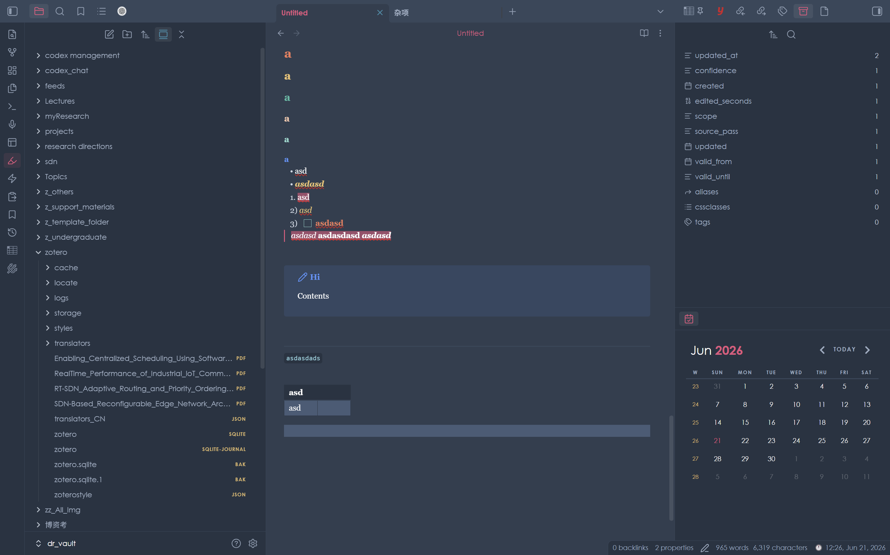

# Enhanced canvas theme for Obsidian

  A transplantation from the enhanced HubSpot Canvas theme for Visual Studio Code to Obsidian.

## Installation

### Direct installatoin

To install the theme

* Open Obsidian Settings
* Go to `Appearance` and click `Manage`
* Under community themes search for "Enhanced Canvas" and click `Use`

## TL; NR

The color template of `Enhanced Canvas` theme in vscode + the interaction interface of `Obsidian Nord` theme.

## Motivation

This is a theme transplanted from the `Enhanced Canvas` theme on vscode (refer to [Enhanced Canvas Theme - Visual Studio Marketplace](https://marketplace.visualstudio.com/items?itemName=NicolasMendes.enhanced-canvas-theme) or [DreamDevourer/Enhanced-HubSpot-VScode-Theme: An updated and enhanced HubSpot theme for Visual Studio Code.](https://github.com/DreamDevourer/Enhanced-HubSpot-VScode-Theme?tab=GPL-3.0-1-ov-file) , which is initially developped by pwilver12 and published by hatreeksbergermon). Since I love that color-style for its vitality, proper abstraction and clearness with unique tone, I decided to do this transplantation (with the help of Codex, i really don't know how and what color would be proper at first).

The interface interaction is inhereted from `Obsidian Nord` theme to retain the sense of cleanness and modernness.
